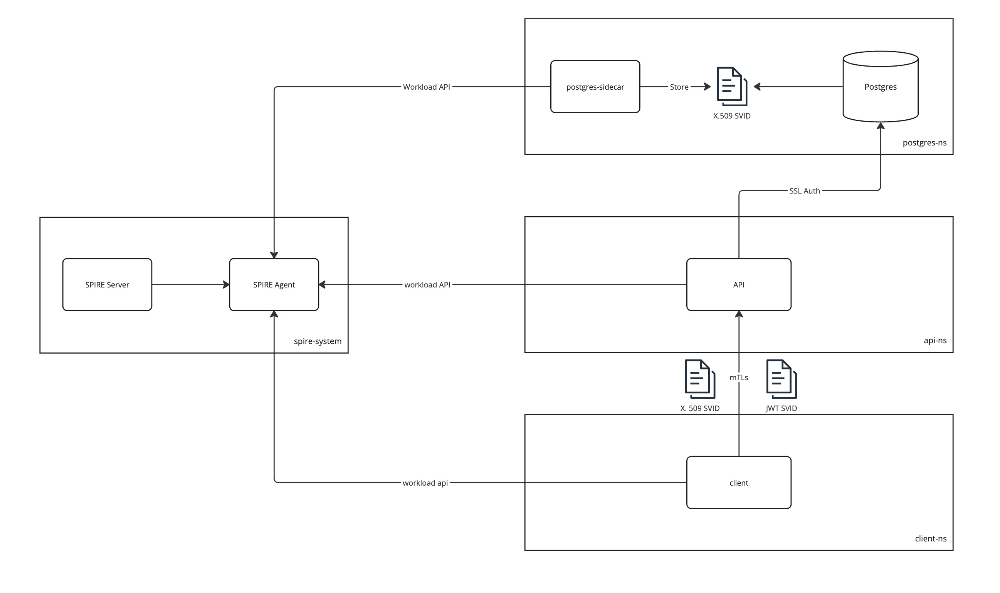

# Force rotation using SPIRE

### Objective

This example demonstrates how to use SPIRE in a Kubernetes environment to enforce the rotation of X.509 and JWT authorities, and propagate new identities to workloads.

### Demo

##### Description

This demo involves four namespaces: `spire`, `postgres-ns`, `api-ns`, and `client-ns`.

The [SPIRE server](k8s/core/spire/spire-server.yaml) is configured with the `k8s_psat` node attestor to validate the identity of agents. The [SPIRE agent](k8s/core/spire/spire-agent.yaml) uses the `k8s` workload attestor to validate the identity of microservices via the workload API and SDS.

The [Customer-db](k8s/demo/postgres-db.yaml) deployment includes a PostgreSQL database configured for SSL mode. It uses SVIDs for authenticating PostgreSQL users attempting to connect to the database. Additionally, it includes a postgres-sidecar (spiffe-helper) that attests against the Workload API, stores SVIDs on disk, and rotates certificates by calling [reload.sh](k8s/demo/postgres-db.yaml#52).

The [API](k8s/demo/api.yaml) pod contains a REST API that attests using the Workload API and presents SVIDs to PostgreSQL to authenticate the `symuser`. The SVID includes a DNS entry with the PostgreSQL username for authentication. The API also creates an HTTP server with mTLS, connecting directly to the agent to obtain its identity and bundles for validating callers. Additionally, it retrieves JWT bundles from the SPIRE Agent to validate presented JWT tokens.

The [client](k8s/demo/client.yaml) pod hosts a simple web page that connects to the API using mTLS. It uses an X.509 SVID obtained from a successful attestation against the SPIRE Agent and presents a JWT token to the same API.

Diagram

##### Entries

All entries are created using spire-controller-manager

### Steps
For this example, we use `kind` to create a cluster that supports `psat`.

- `01-cluster-create.sh`: Downloads all dependencies and creates a Kubernetes cluster using `kind`. If `kind` or `kubectl` are not present, this script downloads them into the `./bin` folder and creates a link to them if they exist.
- `02-build-images.sh`: Builds the required Docker images (spiffe-helper, api, and client).
- `03-deploy.sh`: Adds images to the `kind` cluster and creates namespaces with all required entries.
- `04-get-x509-authorities.sh`: Retrieves the current X.509 authorities.
- `05-prepare-new-x509-authority.sh`: Prepares a new X.509 authority.
- `06-activate-x509-authority.sh`: Activates the prepared X.509 authority.
- `07-taint-x509-authority.sh`: Marks the old X.509 authority as insecure and forces the rotation of all X.509 SVIDs signed by that authority.
- `08-revoke-x509-authority.sh`: Revokes the tainted X.509 authority.
- `09-get-jwt-authorities.sh`: Retrieves the current JWT authorities.
- `10-prepare-new-jwt-authority.sh`: Prepares a new JWT authority.
- `11-activate-jwt-authority.sh`: Activates the prepared JWT authority.
- `12-taint-jwt-authority.sh`: Marks the old JWT authority as insecure and forces the rotation of any JWT SVID signed by that authority.
- `13-revoke-jwt-authority.sh`: Revokes the tainted JWT authority.
