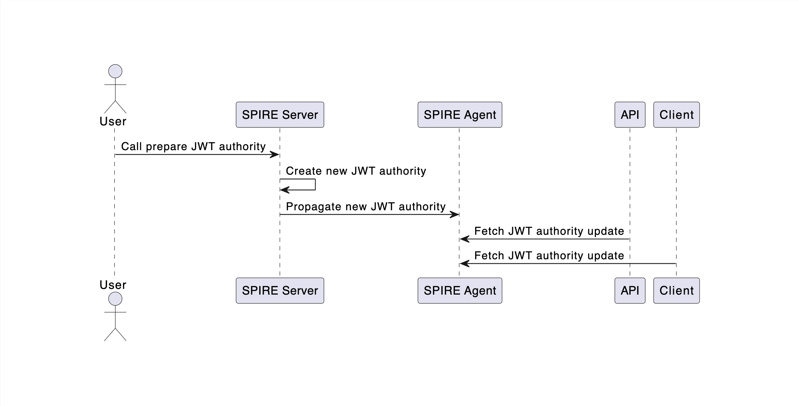
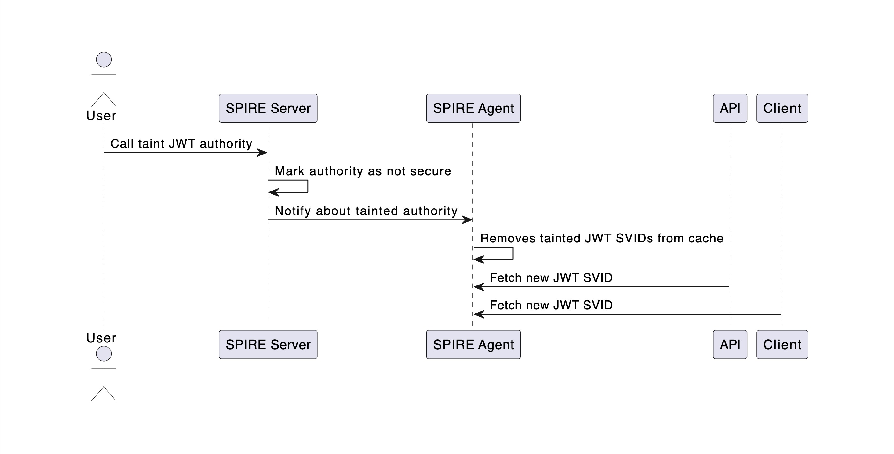

# Rotación forzada usando SPIRE

### Objetivo

Este ejemplo demuestra cómo utilizar SPIRE en un entorno de Kubernetes para forzar la rotación de autoridades X.509 y JWT, y propagar nuevas identidades a las cargas de trabajo.

### Demostración

#### Descripción

Esta demostración involucra cuatro namespaces: `spire`, `postgres-ns`, `api-ns`, y `client-ns`.

El [servidor SPIRE](k8s/core/spire/spire-server.yaml) está configurado con el attestor de nodos `k8s_psat` para validar la identidad de los agentes. El [agente SPIRE](k8s/core/spire/spire-agent.yaml) utiliza el attestor de carga de trabajo `k8s` para validar la identidad de los microservicios mediante la API de carga de trabajo y SDS.

La implementación de [Customer-db](k8s/demo/postgres-db.yaml) incluye una base de datos PostgreSQL configurada en modo SSL. Utiliza SVIDs para autenticar a los usuarios de PostgreSQL que intentan conectarse a la base de datos. Además, incluye un postgres-sidecar (spiffe-helper) que se atesta contra la API de carga de trabajo, almacena SVIDs en disco y rota certificados ejecutando [reload.sh](k8s/demo/postgres-db.yaml#52).

El pod de la [API](k8s/demo/api.yaml) contiene una API REST que se atesta usando la API de carga de trabajo y presenta SVIDs a PostgreSQL para autenticar al usuario `symuser`. El SVID incluye una entrada DNS con el nombre de usuario de PostgreSQL para la autenticación. La API también crea un servidor HTTP con mTLS, conectándose directamente al agente para obtener su identidad y los paquetes para validar a los llamantes. Adicionalmente, recupera paquetes JWT del Agente SPIRE para validar tokens JWT presentados.

El pod de [cliente](k8s/demo/client.yaml) aloja una página web simple que se conecta a la API usando mTLS. Utiliza un SVID X.509 obtenido de una atestación exitosa contra el Agente SPIRE y presenta un token JWT a la misma API.

### Diagramas

#### Despliegue

#### Preparar autoridad X.509

#### Activar autoridad X.509

#### Marcar como insegura autoridad X.509

#### Revocar autoridad X.509

#### Preparar autoridad JWT

#### Activar autoridad JWT

#### Marcar como insegura autoridad JWT

#### Revocar autoridad JWT

#### Entradas

Todas las entradas son creadas usando `spire-controller-manager`.

### Pasos
Para este ejemplo, utilizamos `kind` para crear un clúster que soporte `psat`.

- `01-cluster-create.sh`: Descarga todas las dependencias y crea un clúster de Kubernetes usando `kind`. Si `kind` o `kubectl` no están presentes, este script los descarga en la carpeta `./bin` y crea un enlace a ellos si existen.
- `02-build-images.sh`: Construye las imágenes Docker requeridas (spiffe-helper, api y cliente).
- `03-deploy.sh`: Agrega imágenes al clúster `kind` y crea namespaces con todas las entradas necesarias.
- `04-get-x509-authorities.sh`: Recupera las autoridades X.509 actuales.
- `05-prepare-new-x509-authority.sh`: Prepara una nueva autoridad X.509.
- `06-activate-x509-authority.sh`: Activa la autoridad X.509 preparada.
- `07-taint-x509-authority.sh`: Marca la autoridad X.509 antigua como insegura y fuerza la rotación de todos los SVIDs X.509 firmados por esa autoridad.
- `08-revoke-x509-authority.sh`: Revoca la autoridad X.509 marcada como insegura.
- `09-get-jwt-authorities.sh`: Recupera las autoridades JWT actuales.
- `10-prepare-new-jwt-authority.sh`: Prepara una nueva autoridad JWT.
- `11-activate-jwt-authority.sh`: Activa la autoridad JWT preparada.
- `12-taint-jwt-authority.sh`: Marca la autoridad JWT antigua como insegura y fuerza la rotación de cualquier SVID JWT firmado por esa autoridad.
- `13-revoke-jwt-authority.sh`: Revoca la autoridad JWT marcada como insegura.
